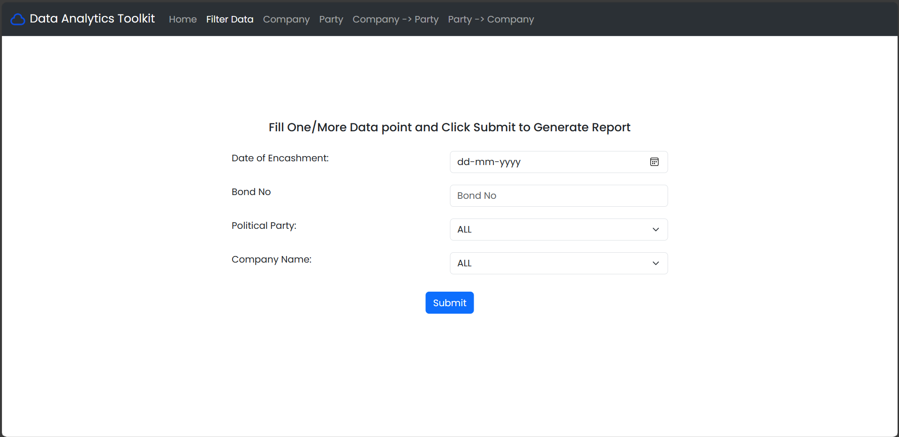
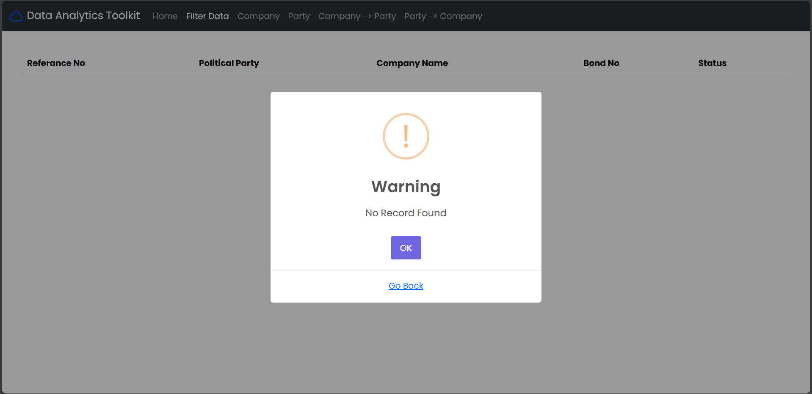
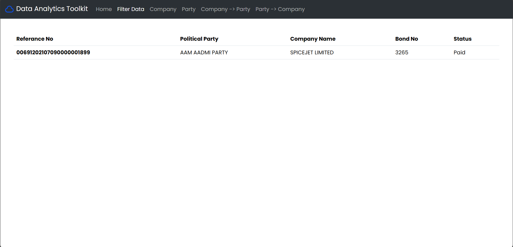
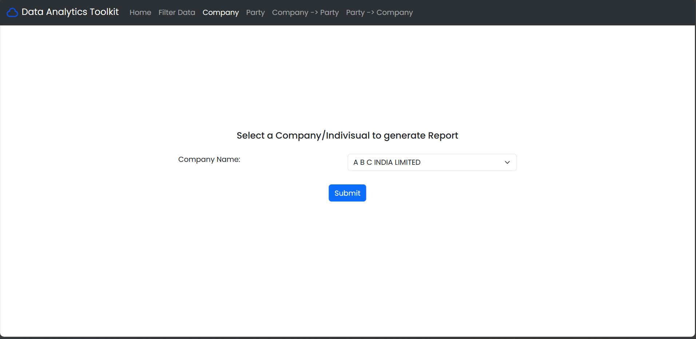

# Submission of Assignment 4 [ES113]

## Submission Details

* Name: Vivek Raj
* Roll No: 23110352
* Cource Code: ES113

## Conversion

Conversion was done by the fitz module and the progress was tracked by the Progress module

## E1

The Drop Downs are populated by flask. And validation is present to check if the user is messing around with the system

### E1 Blank Form

### E1 Not Valid Parameter(s)

### E1 Output

## E2

The Drop Downs are populated by flask. Hence no validaton is present as user cannot do any invalid commands.
