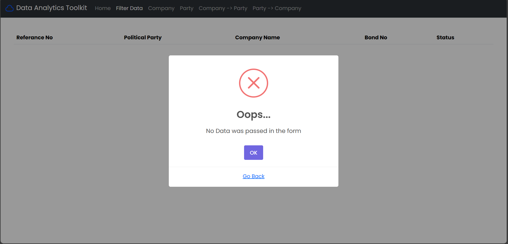

# Submission of Assignment 4 [ES113]

## Submission Details

* Name: Vivek Raj
* Roll No: 23110352
* Cource Code: ES113

## Conversion

Conversion was done by the fitz module and the progress was tracked by the Progress module

## E1

The Drop Downs are populated by flask. And validation is present to check if the user is messing around with the system

### E1 Output

## E2

The Drop Downs are populated by flask. Hence no validaton is present as user cannot do any invalid commands.

### E2 Output

## E3 

The Drop Downs are populated by flask. Hence no validaton is present as user cannot do any invalid commands.

### E3 Output

## E4

The Drop Downs are populated by flask. Hence no validaton is present as user cannot do any invalid commands.

### E4 Output

## E5

The Drop Downs are populated by flask. Hence no validaton is present as user cannot do any invalid commands.

### E5 Output

## E6 (Download)

## EXTRA FEATURE (FORM VALIDATION USING SWAL)
### Blank Form

### Not Valid Parameter(s)

## Favicon

## Langing Page

## Fully Functioning Navbar

